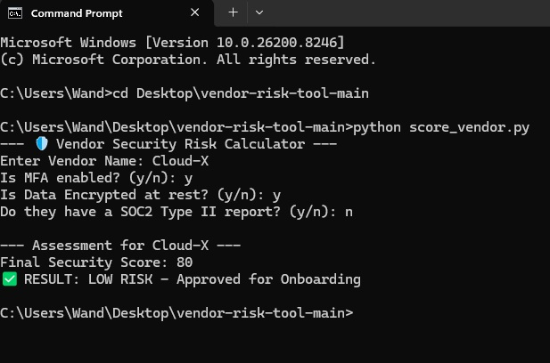

# Vendor Risk Scoring Tool
A Python-based utility to automate the calculation of risk scores for third-party vendors based on security assessment data.

## 📌 Project Overview
In many GRC environments, vendor assessments are manual and inconsistent. This tool standardizes the evaluation process by applying a weighted scoring logic to vendor security posture, aligning with **NIST SP 800-161** and **ISO 27001** supply chain requirements.



## 🚀 Key Features
* **Automated Scoring:** Calculates residual risk based on control effectiveness and data sensitivity.
* **Risk Tiering:** Automatically categorizes vendors into Critical, High, Medium, or Low risk tiers.
* **Consistency:** Removes human bias from the initial assessment phase.
* **Reporting:** Generates a structured output for GRC analyst review.

## 🛠️ Installation & Usage
1. **Clone the repository:**
   ```bash
   git clone https://github.com
   cd vendor-risk-tool
   ```
2. **Run the tool:**
   ```bash
   python score_vendor.py
   ```

## ⚖️ Scoring Methodology
This tool utilizes a weighted matrix to evaluate risk across four primary domains:
1. **Data Privacy:** Encryption standards and data handling practices.
2. **Access Control:** MFA implementation and least-privilege enforcement.
3. **Incident Response:** Evidence of tested IR plans.
4. **Compliance:** Presence of SOC 2 Type II or ISO 27001 certifications.

## 📈 Future Roadmap
- [ ] Integration with GitHub Actions for automated vendor "re-checks."
- [ ] Export functionality to CSV/PDF for executive reporting.
- [ ] API integration with common GRC platforms.
